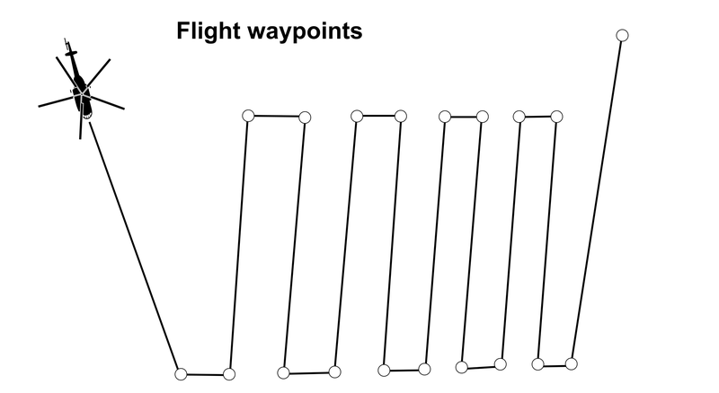
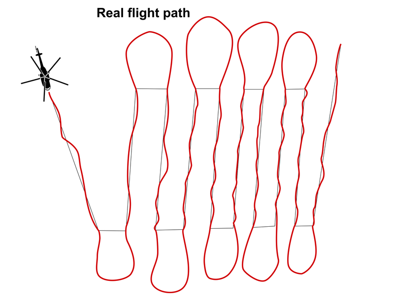

# GIS related ideas/topics for student theses and other projects

**General requirements:**
- optimally platform independent solution (Windows / Linux)
- final code released as open-source

## Available topics - sopftware related

### 0) QGIS - Conversion of old plugins for QGIS2 to QGIS3

Ground Radiation Monitoring QGIS Plugin
https://ctu-geoforall-lab.github.io/qgis-ground-radiation-monitoring-plugin/

Radiation Reconnaissance Results QGIS Plugin
https://ctu-geoforall-lab.github.io/qgis-radiation-reconnaissance-results-plugin/

### 1) Simulated flight path generator

*Requirements*

- no need for GUI, can be CLI (console) application or script
- rather not Windows-only, but can be linux-only (possible to run using virtual machine)
- not dependent on any paid / commercial software or 3rd party online service
- input - depends on further discussion with the developer, we can provide various formats...
- output can be just CSV

*Description*

Brief description: use GPS (EPSG:4326) waypoint data roughly defining planned path and perform helicopter flight simulation - e.g.:

- generate route points according to time / speed preset - there is constant time interval between points (usually 1 second), and there is planned speed like 100 km/h but the speed is not constant in real condition and is lower especially in the turns (data for analyses will be released later) 

- add some flight inaccuracy (the flight path is never straight)

- calculate additional parameters like GPS heading, UTM coordinates - there seems to be a way to calculate appropriate UTM zone from lat / lon https://stackoverflow.com/questions/58828828/auto-detect-coordinate-reference-system-based-on-coordinates-in-gpx-file

- include flying out of the monitoring area when turning from one monitoring line to other

Check DEMO Airborne gammaspectrometric data "Uluru" for details:
https://github.com/juhele/opengeodata/tree/master/Airborne_gammaspectrometry_demo_data

- contains both flight plan data and real flight path

*Why do wee need it?*

We are able to simulate measured data but would be useful being able to generate custom and purely fictional monitoring paths - mainly for training purposes.

**Available data**

- we can provide several datasets with real flight paths (GPS, speed, heading, altitude) and technical details about used helicopters

### 2) Dosimeter pickup plugin for QGIS

*Requirements*
- QGIS 3.x plugin
- use UTF-8 CR-LF encoding for text outputs for full Windows/Unix compatibility

*Introduction*

The territorial network of thermoluminescent dosimeters (TLD) is a part of the Czech Radiation Monitoring Network. Consists of 180 points with dosimeters - some outdoors, some in buildings.

In case of a normal radiation situation, the measurements are performed quarterly, in case of a radiation accident more often. The dosimeters are gradually collected by car and transported to the lab to get the results.

details in English:
https://www.suro.cz/en/rms/tld

details in Czech:
https://www.suro.cz/cz/rms/tld/sit-termoluminiscencnich-dozimetru-tld-sit

*Problem to solve*

As described above, the dosimeters are placed in various locations (e.g. input dataset with static locations and ID / name). The dosimeters are replaced with "new" ones from time to time and in case of some emergency it is planned to perform such replacement more often (the time interval is not important for this task).

So someone takes a car, picks up all the dosimeters and takes them in a lab to be analysed to get the dose values for each one. 

However we do not know how big was the part of the dose obtained during the transport - which may not be negligible for emergency situations and is different for each of the dosimeters:

**Task 1 - determine car stop at the pickup station**
- measurement data contain GPS, dose rate values and time (mostly in GPS Epoch format)
- input layer of stations is static
- it is not always possible to park directly at the station, some detection algorithm needs to be implemented (it is possible to calculate speed or use station proximity...)

**Task 2 - calculate the dose**
- relatively easy ... dose in microSieverts is dose rate in microSieverts per hour multiplied by time in hours for particular interval (between two measurement points)
- the dose for each dosimeter starts counting after pickup and ends with delivery - e.g. the time is not equal for the dosimeters (see pic above) 
- result can be some vector point layer (Shapefile, GeoPackage) with the calculated and measured data - all the auxiliary values can also be stored in the attribute table

**Task 3 - generate text report**
- simple text file is enough and universal for mailing or other processing
- use UTF-8 CR-LF encoding for text outputs for full Windows/Unix compatibility
- use some predefined description + add values for particular dosimeters - the dosimeter could have just some number and information about pickup station like "Dosimeter no.1, pickup station: Kutná Hora" where the number is automatically generated and pickup station name taken from the static station layer

## Available topics - hardware related (not so much GIS)

### 1) easy to use differential GPS system (dGPS/GNSS) for field workers

*Introduction*

Precise GPS systems are complicated to use and mostly require some additional correction data / signal using paid services, often via mobile internet connection. 
Examples:
StarFire by John Deere's NavCom
https://en.wikipedia.org/wiki/StarFire_(navigation_system)
CZEPOS - for geodetic applications, limited to Czech Republic
http://czepos.cuzk.cz/

*Possible information resources*

FAIL OF THE WEEK: HOW NOT TO BUILD YOUR OWN DGPS BASE STATION
by: Christian Trapp
March 30, 2018
https://hackaday.com/2018/03/30/fail-of-the-week-how-not-to-build-your-own-dgps-base-station/

Nízkonákladová realizace Diferenciální GPS pomocí systému Arduino /
Low-cost implementation of Differential GPS using Arduino

zdroj:
https://dspace.cvut.cz/bitstream/handle/10467/68266/F6-DP-2016-Svaton-Martin-Thesis_signed.pdf?sequence=1&isAllowed=y

Sub Centimeter GPS With RTKLIB
https://www.instructables.com/id/Sub-Centimeter-GPS-With-RTKLIB/

MORE THAN GPS: DGPS, MULTI-BAND RTK
This article gives an introduction for the GPS keywords DGPS, multi-band and RTK and shows performance demos of  some specific RTK GPS systems.
http://grauonline.de/wordpress/?page_id=1468

