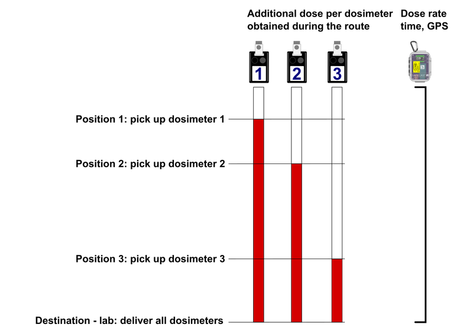

# GIS related ideas/topics for student theses and other projects

**General requirements:**
- optimally platform independent solution (Windows / Linux)
- final code released as open-source

## Available topics

### Simulated flight path generator

Brief description: use GPS (EPSG:4326) waypoint data roughly defining planned path and perform flight simulation - e.g.:

- generate route points according to time / speed preset - there is constant time interval between points (usually 1 second), and there is planned speed like 100 km/h but the speed is not constant in real condition and is lower especially in the turns 

- add some flight inaccuracy (the flight path is never straight)

- calculate additional parameters like GPS heading, 

- include flying out of the monitoring area when turning from one monitoring line to other

Check DEMO Airborne gammaspectrometric data "Uluru" for details:
https://github.com/juhele/opengeodata/tree/master/Airborne_gammaspectrometry_demo_data

- contains both flight plan data and real flight path

todo: add more detailed description + images

### Dosimeter pickup plugin for QGIS

*Requirements*
- QGIS 3.x plugin
- use UTF-8 CR-LF encoding for text outputs for full Windows/Unix compatibility

*Introduction*

The territorial network of thermoluminescent dosimeters (TLD) is a part of the Czech Radiation Monitoring Network. Consists of 180 points with dosimeters - some outdoors, some in buildings.

In case of a normal radiation situation, the measurements are performed quarterly, in case of a radiation accident more often. The dosimeters are gradually collected by car and transported to the lab to get the results.

details in English:
https://www.suro.cz/en/rms/tld

details in Czech:
https://www.suro.cz/cz/rms/tld/sit-termoluminiscencnich-dozimetru-tld-sit

*Problem to solve*

As described above, the dosimeters are placed in various locations (e.g. input dataset with static locations and ID / name). The dosimeters are replaced with "new" ones from time to time and in case of some emergency it is planned to perform such replacement more often (the time interval is not important for this task).

So someone takes a car, picks up all the dosimeters and takes them in a lab to be analysed to get the dose values for each one. 

However we do not know how big was the part of the dose obtained during the transport - which may not be negligible for emergency situations and is different for each of the dosimeters:

todo:
add data and more details
