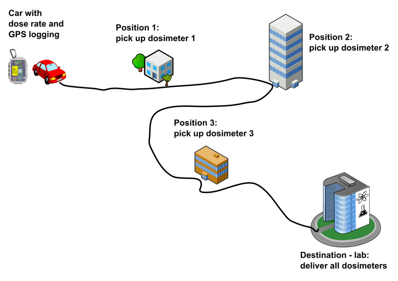

# GIS related ideas/topics for student theses and other projects

**General requirements:**
- optimally platform independent solution (Windows / Linux)
- final code released as open-source

## Available topics - sopftware related

### 0) QGIS - Conversion of old plugins for QGIS2 to QGIS3

Ground Radiation Monitoring QGIS Plugin
https://ctu-geoforall-lab.github.io/qgis-ground-radiation-monitoring-plugin/

Radiation Reconnaissance Results QGIS Plugin
https://ctu-geoforall-lab.github.io/qgis-radiation-reconnaissance-results-plugin/

### 1) Simulated flight path generator

*Requirements*

- no need for GUI, can be CLI (console) application or script
- rather not Windows-only, but can be linux-only (possible to run using virtual machine)
- not dependent on any paid / commercial software or 3rd party online service
- input - depends on further discussion with the developer, we can provide various formats...
- output can be just CSV (map display is not necessarily required, data will be further processed)

*Description*

Brief description: use GPS (EPSG:4326) waypoint data roughly defining planned path and perform helicopter flight simulation - e.g.:

- generate route points according to time / speed preset - there is constant time interval between points (usually 1 second), and there is planned speed like 100 km/h but the speed is not constant in real condition and is lower especially in the turns (data for analyses will be released later) 

- add some flight inaccuracy (the flight path is never straight)

- calculate additional parameters like GPS heading, UTM coordinates - there seems to be a way to calculate appropriate UTM zone from lat / lon https://stackoverflow.com/questions/58828828/auto-detect-coordinate-reference-system-based-on-coordinates-in-gpx-file

- include flying out of the monitoring area when turning from one monitoring line to other

Check DEMO Airborne gammaspectrometric data "Uluru" for details:
https://github.com/juhele/opengeodata/tree/master/Airborne_gammaspectrometry_demo_data

- contains both flight plan data and real flight path

*Why do wee need it?*

We are able to simulate measured data but would be useful being able to generate custom and purely fictional monitoring paths - mainly for training purposes.

**Available data**

- we can provide several datasets with real flight paths (GPS, speed, heading, altitude) and technical details about used helicopters

### 2) Dosimeter pickup plugin for QGIS

*Requirements*
- QGIS 3.x plugin
- use UTF-8 CR-LF encoding for text outputs for full Windows/Unix compatibility

*Introduction*

The territorial network of thermoluminescent dosimeters (TLD) is a part of the Czech Radiation Monitoring Network. Consists of 180 points with dosimeters - some outdoors, some in buildings.

In case of a normal radiation situation, the measurements are performed quarterly, in case of a radiation accident more often. The dosimeters are gradually collected by car and transported to the lab to get the results.

details in English:
https://www.suro.cz/en/rms/tld

details in Czech:
https://www.suro.cz/cz/rms/tld/sit-termoluminiscencnich-dozimetru-tld-sit

*Problem to solve*

As described above, the dosimeters are placed in various locations (e.g. input dataset with static locations and ID / name). The dosimeters are replaced with "new" ones from time to time and in case of some emergency it is planned to perform such replacement more often (the time interval is not important for this task).

So someone takes a car, picks up all the dosimeters and takes them in a lab to be analysed to get the dose values for each one. 

However we do not know how big was the part of the dose obtained during the transport - which may not be negligible for emergency situations and is different for each of the dosimeters:

**Task 1 - determine car stop at the pickup station**
- measurement data contain GPS, dose rate values and time (mostly in GPS Epoch format)
- input layer of stations is static
- it is not always possible to park directly at the station, some detection algorithm needs to be implemented (it is possible to calculate speed or use station proximity...)

**Task 2 - calculate the dose**
- relatively easy ... dose in microSieverts is dose rate in microSieverts per hour multiplied by time in hours for particular interval (between two measurement points)
- the dose for each dosimeter starts counting after pickup and ends with delivery - e.g. the time is not equal for the dosimeters (see pic above) 
- result can be some vector point layer (Shapefile, GeoPackage) with the calculated and measured data - all the auxiliary values can also be stored in the attribute table

**Task 3 - generate text report**
- simple text file is enough and universal for mailing or other processing
- use UTF-8 CR-LF encoding for text outputs for full Windows/Unix compatibility
- use some predefined description + add values for particular dosimeters - the dosimeter could have just some number and information about pickup station like "Dosimeter no.1, pickup station: Kutná Hora" where the number is automatically generated and pickup station name taken from the static station layer

PS: some code from https://ctu-geoforall-lab.github.io/qgis-ground-radiation-monitoring-plugin/ might be useful for reuse here :-)

## Available topics - hardware related (not so much GIS)

### 3) easy to use differential GPS system (dGPS/GNSS) for field workers

*Introduction*

Precise GPS systems are complicated to use and mostly require some additional correction data / signal using paid services, often via mobile internet connection. 
Examples:

StarFire by John Deere's NavCom 
https://en.wikipedia.org/wiki/StarFire_(navigation_system)

CZEPOS - for geodetic applications, limited to Czech Republic 
http://czepos.cuzk.cz/

*Idea*

Looks like it would be possible to develop a custom, tailor-made system based on RTK (Real-time kinematic, see description below) - e.g. two portable outdoor boxes (some rugged plastic case) with antenna, on/off switch and some status LCD or LED lights. One box with tripod mount ("base"), second intended for the moving ("rover") - carried by a person, robot etc. Easy to use - so it could be used by common workers - "just switch on, wait for green and blue light and then go. After your field work switch it off and bring me the boxes so I can download the data.".

Such system could be independent and usable almost everwhere (there are some restricions related to the short-range radio used for communication between the base station and rover but these could be same for the EU).

Data logging automatically after switching on: lat, lon, date, time, GPS epoch, number of satelites, HDOP. Format could be some sort of text file - for example CSV.

*Requirements*

- solution not requiring internet connection
- not dependent on any paid / commercial software or 3rd party online service
- device controls using hardware buttons / switches, not touch screen (we can provide some help in this area)
- possibly low power consumption - e.g. not x86 PC but rather something like ARM (Raspberry etc.) or MCU (Arduino etc.) in order to improve battery life
- OPTIONAL enhancenment: button for creating "bookmarks" - somehow to mark particular positions for easier processing

*Possible use*

Detailed radiation measurements, radon surveys, soil and other sampling. Everywhere where common GPS is not precise enough and geodetic GPS is too expensive or too complicated.
Sampling data can be later assigned to the coordinates based on time (written notes in protocols etc.) or visually in GIS software like QGIS.

*Information resources*

FAIL OF THE WEEK: HOW NOT TO BUILD YOUR OWN DGPS BASE STATION
by: Christian Trapp
March 30, 2018
https://hackaday.com/2018/03/30/fail-of-the-week-how-not-to-build-your-own-dgps-base-station/

Nízkonákladová realizace Diferenciální GPS pomocí systému Arduino /
Low-cost implementation of Differential GPS using Arduino
https://dspace.cvut.cz/bitstream/handle/10467/68266/F6-DP-2016-Svaton-Martin-Thesis_signed.pdf?sequence=1&isAllowed=y

Sub Centimeter GPS With RTKLIB
https://www.instructables.com/id/Sub-Centimeter-GPS-With-RTKLIB/

MORE THAN GPS: DGPS, MULTI-BAND RTK
This article gives an introduction for the GPS keywords DGPS, multi-band and RTK and shows performance demos of  some specific RTK GPS systems.
http://grauonline.de/wordpress/?page_id=1468

Real-time kinematic (RTK) 
"Real-time kinematic (RTK) positioning is a satellite navigation technique used to enhance the precision of position data derived from satellite-based positioning systems (global navigation satellite systems, GNSS) such as GPS, GLONASS, Galileo, NavIC and BeiDou. It uses measurements of the phase of the signal's carrier wave in addition to the information content of the signal and relies on a single reference station or interpolated virtual station to provide real-time corrections, providing up to centimetre-level accuracy.[1] With reference to GPS in particular, the system is commonly referred to as carrier-phase enhancement, or CPGPS.[2] It has applications in land survey, hydrographic survey, and in unmanned aerial vehicle navigation. "
https://en.wikipedia.org/wiki/Real-time_kinematic

W Stempfhuber, M Buchholz: A precise, low-cost RTK GNSS system for UAV applications
September 2012, ISPRS - International Archives of the Photogrammetry Remote Sensing and Spatial Information Sciences XXXVIII-1/C22(1)
DOI: 10.5194/isprsarchives-XXXVIII-1-C22-289-2011
https://www.researchgate.net/publication/268438790_A_precise_low-cost_RTK_GNSS_system_for_UAV_applications

Tomoji Takasu, Akio Yasuda: Development of the low-cost RTK-GPS receiver with an open source program package RTKLIB
January 2009
https://www.researchgate.net/publication/228811569_Development_of_the_low-cost_RTK-GPS_receiver_with_an_open_source_program_package_RTKLIB

Evaluation of Low-Cost, Centimeter-Level Accuracy OEM GNSS Receivers
Demoz Gebre-Egziabher, Principal Investigator, Department of Aerospace Engineering and Mechanics, University of Minnesota 
February 2018, Research Project, Final Report 2018-10
https://www.google.com/url?sa=t&rct=j&q=&esrc=s&source=web&cd=&cad=rja&uact=8&ved=2ahUKEwjMiJG9nsrrAhVMAWMBHYMUDLEQFjAHegQIBhAB&url=http%3A%2F%2Fwww.dot.state.mn.us%2Fresearch%2Freports%2F2018%2F201810.pdf&usg=AOvVaw0HTOPIpBMlvD7g4sx5kSgf

John Jackson ; Brian Davis ; Demoz Gebre-Egziabher: A performance assessment of low-cost RTK GNSS receivers
Published in: 2018 IEEE/ION Position, Location and Navigation Symposium (PLANS)
Date of Conference: 23-26 April 2018
Date Added to IEEE Xplore: 07 June 2018
ISBN Information: Electronic ISSN: 2153-3598
INSPEC Accession Number: 17823276
DOI: 10.1109/PLANS.2018.8373438
Publisher: IEEE
Conference Location: Monterey, CA, USA
https://ieeexplore.ieee.org/document/8373438
