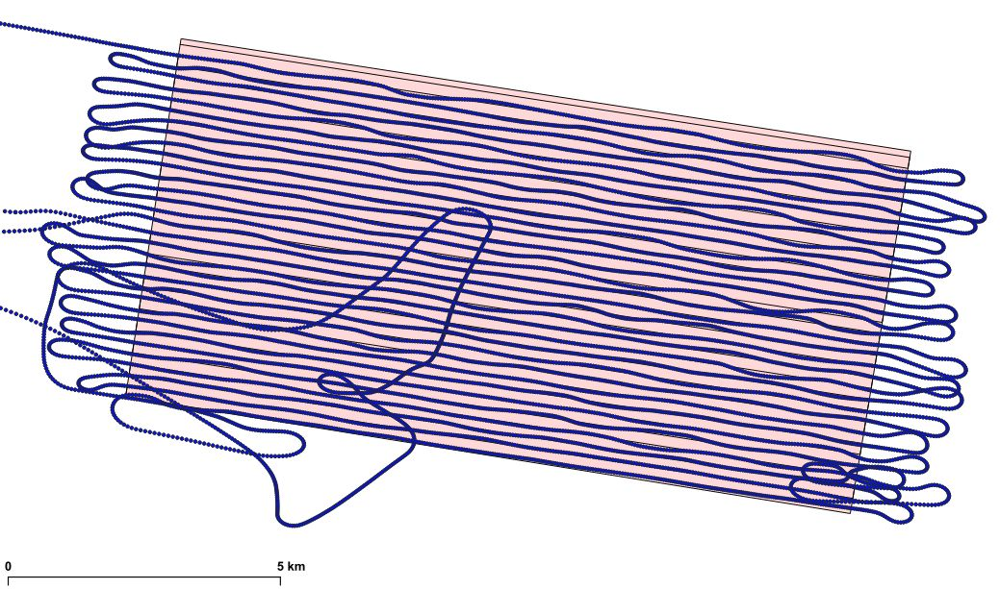
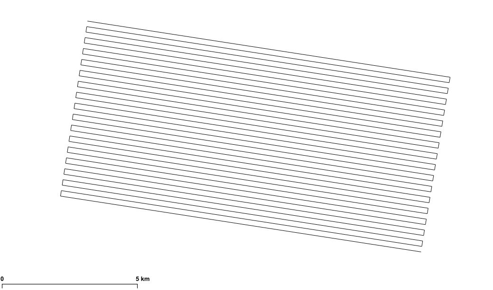
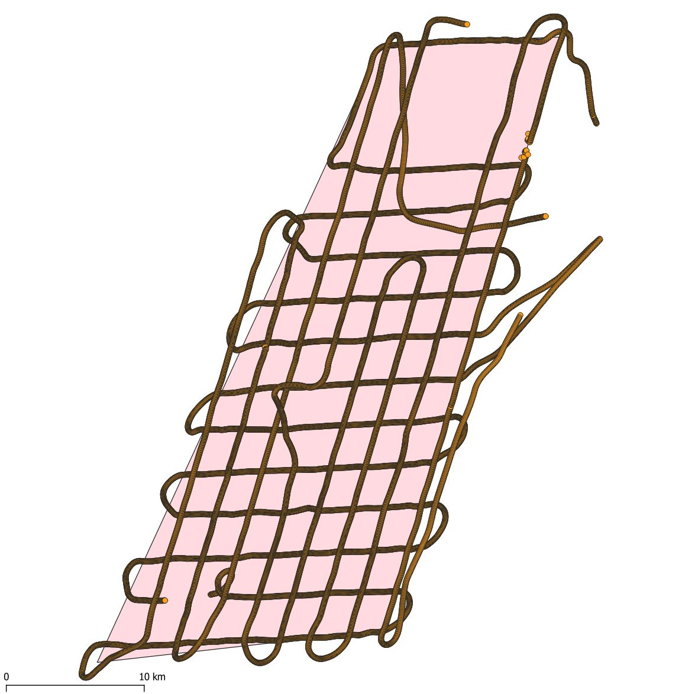
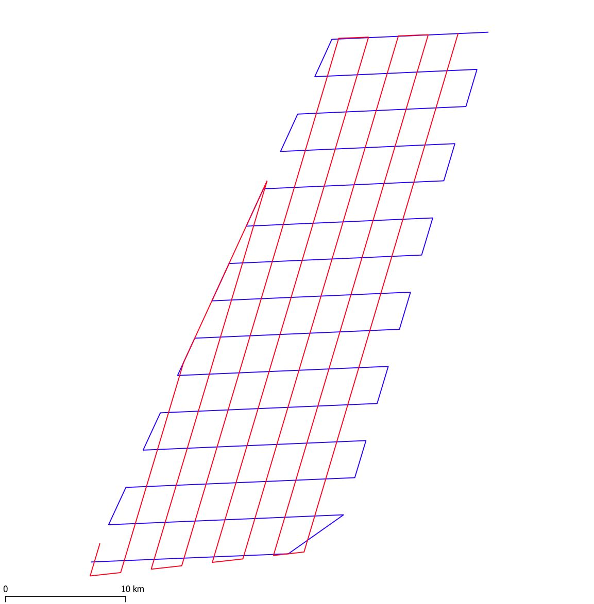

**About the data placed in Australia**

The flight heights are real. The points were moved to other location but the dataset was not changed in other way (e.g. not rescaled, transformed etc.).
The GPS altitude values were calculated using DEM-S dataset by Geoscience Australia:

Gallant, J. 1, Wilson, N. 2, Dowling, T. 3, Read, A. 4, Inskeep, C. 5 2011. SRTM-derived 1 Second Digital Elevation Models Version 1.0. Record 1. Geoscience Australia, Canberra. 
http://pid.geoscience.gov.au/dataset/ga/72759

**01_Ranger_mine_Kakadu_NP_AUS_Mi-17_heli**

support dataset - fictional airborne monitoring in Ranger Uranium Mine area:

"The Ranger Uranium Mine is a uranium mine in the Northern Territory of Australia. It is surrounded by, but separate from Kakadu National Park, 230 km east of Darwin. The orebody was discovered in late 1969, and the mine commenced operation in 1980, reaching full production of uranium oxide in 1981. It is operated by Energy Resources of Australia, a 68% subsidiary of Rio Tinto Group. Uranium mined at Ranger is sold for use in nuclear power stations in Asia, Europe and North America."

Source: https://en.wikipedia.org/wiki/Ranger_Uranium_Mine

The flight path is real, but was moved to different location, date and time was changed (date set to 2001-04-01).

This package contains support data for flight proposed "Simulated flight path generator" in standard formats (CSV, GeoPackage).

Polygon (monitoring area)
- both polygon vector layer and file with corner coordinates

Survey lines
- planned flight path
- both line vector layer and file with node coordinates

real flight path and polygon

planned survey lines / planned flight path

**02_Valley_of_Fire_USA_Mi-17_heli**

real flight path and polygon

planned survey lines / planned flight path

